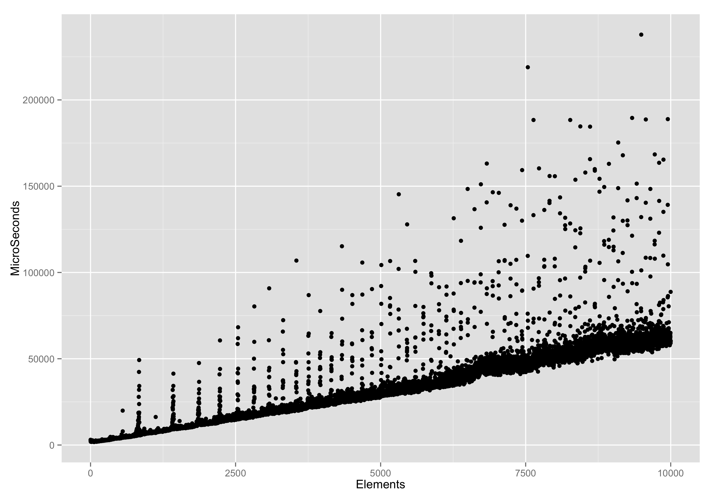
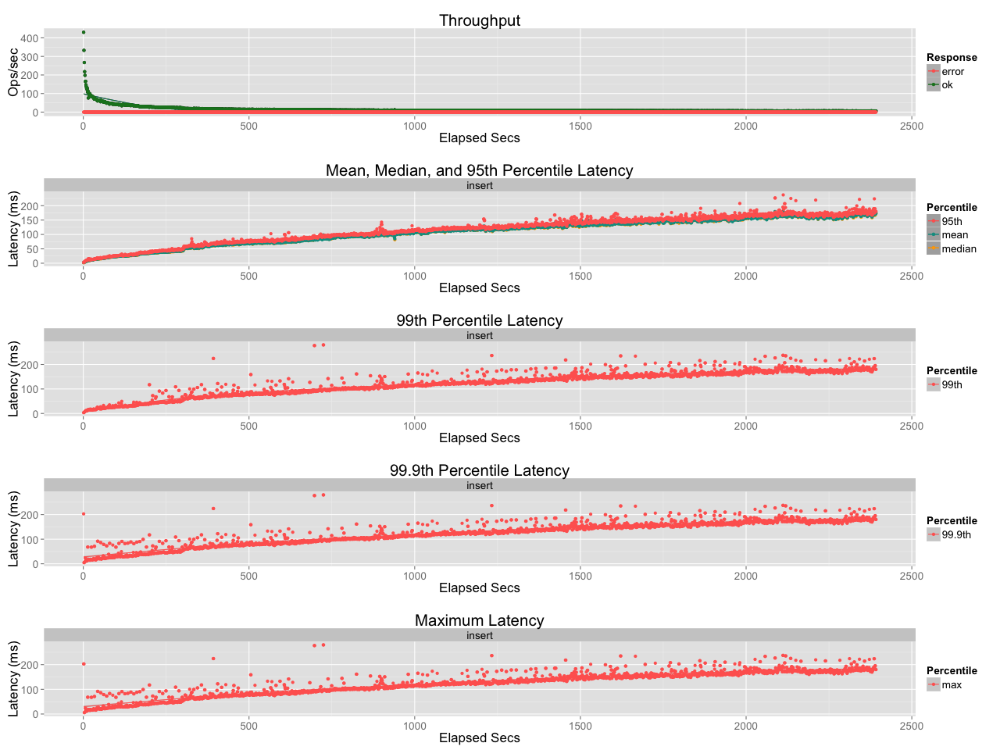
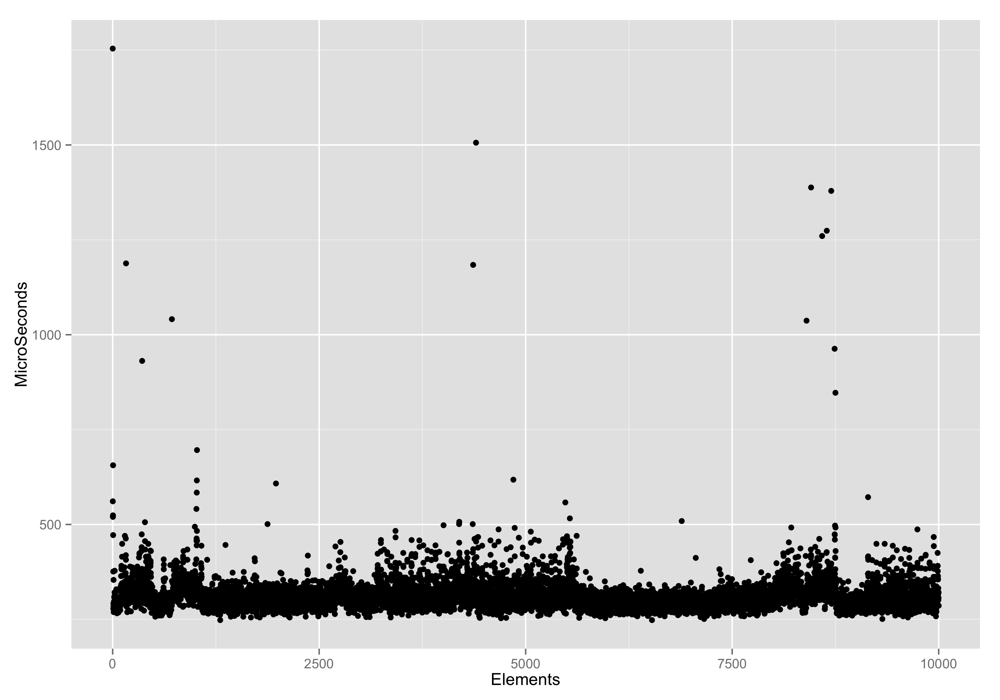
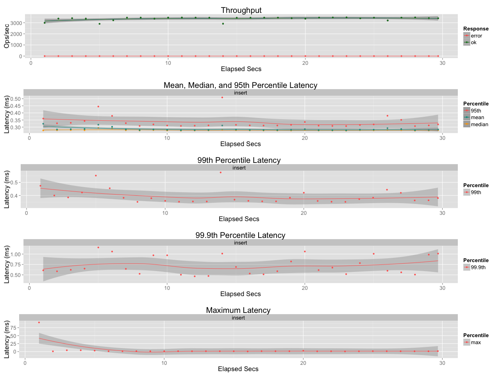

bigset: A Riak Core Application
======================================

# What?
A prototype / PoC delta orswot database built on riak-core

# Why?

Inserting an element into a set in riak's data types Implementation
involves reading the whole set off disk, deserialising it, appending
the new element, reserialising, and writing, then replicating to N-1
replicas. If you were unlucky any or all of the replicas updated that
set concurrently, so at each replica you must read the whole set,
merge the incoming and local sets, serialise, and write to disk. That
dance means sets are not very scalable on riak.

Here is a graph of inserting just 10k elements into riak:

Here is one of basho_bench trying to load 100k elements into a single set:

I had to kill the run before my machine melted.

## Really WHY?

Serious? OK: because adding and element to a set should not take time
proportional to the size of the set. We're looking for something
better than `O(n)`. If we can add elements efficiently, and look them
up efficiently, maybe we can have sets that are pretty large. Like
100s of 1000s, or even millions of elements.

# How?

See the doc (doc/design.md) for details. The overview is:

don't store everything in one key. Use a logical clock that we read
per write to generate dots, and then append the new elements and dots
to the set. Take advantage of Level for this.

As a taster, here are some current results:

And here is that 100k insert run in basho-bench

I think that shows enough promise to work on.

# When?

I'm working on it. Current sticking points

* reads are really slow as they are a fold of N keys
* batch inserts are slow as they generate N writes

Pretty sure you can check JIRA for the plan and progress.

